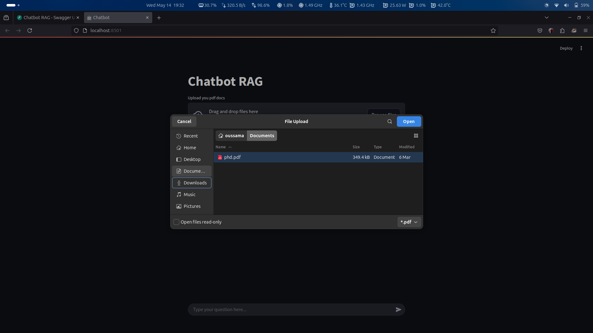
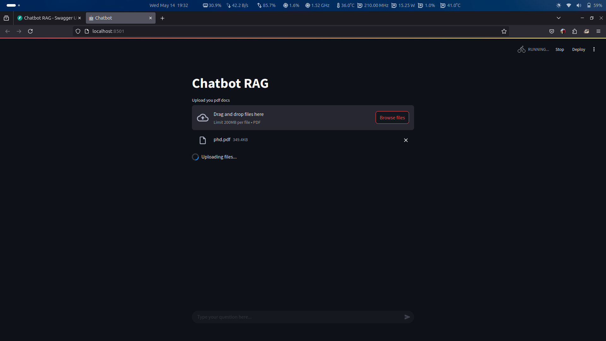
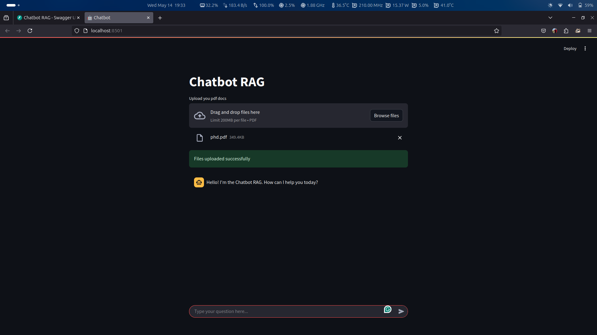
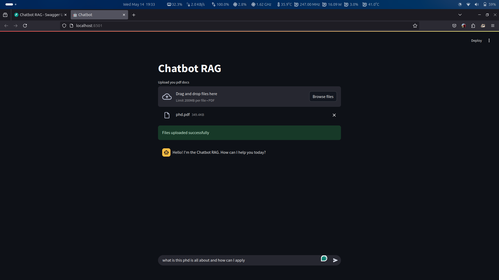
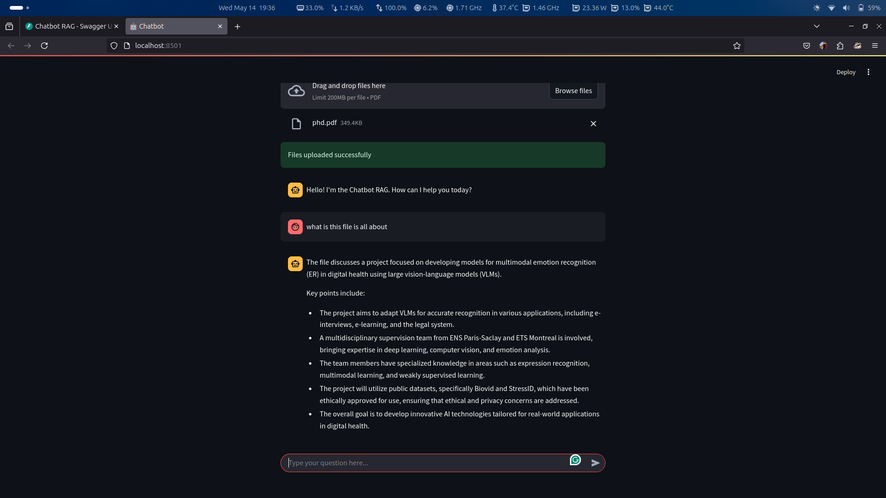

# RAG Chatbot

## Overview

This educational project aims to help learners understand how to create a Retrieval-Augmented Generation (RAG) chatbot using FastAPI, Langchain, OpenAI's language model, and Chroma as a vector database. The project guides you through the process of building a RESTful API with FastAPI, implementing API exception handling, creating Langchain chains, leveraging context and retrieval chains, and embedding and saving PDF files into a vector database.

## Project Structure

```plaintext
chatbot-rag/
├── data/                # Directory to hold the local vector database
├── api.py               # FastAPI server
├── app.py               # Streamlit web application
├── chatbot.py           # Core chatbot logic
├── requirements.txt     # Python dependencies
├── README.md            # Project documentation
└── .env                 # Environment variables (e.g., API keys)
```

### File Descriptions

- **api.py**: This file contains the FastAPI server implementation. It defines the API endpoints for uploading documents, searching documents, and asking questions to the chatbot. It also includes request and response models for structured data handling.

- **app.py**: This file contains the Streamlit application implementation. It defines the the user interface to enable users to use the chatbot api. it allows for upload pdf files and chat with the ai about them.

- **chatbot.py**: This file contains the core logic for the chatbot. It includes functions for retrieving documents, asking questions, storing documents, and parsing PDF files. It integrates with Langchain and OpenAI's API to provide responses based on the uploaded documents.

- **requirements.txt**: This file lists the required Python packages for the project, including FastAPI, Langchain, and other dependencies necessary for running the chatbot.

- **README.md**: This file provides documentation for the project, including an overview, setup instructions, and usage guidelines.

- **.env**: This file is used to store environment variables, such as API keys, which are necessary for the application to function properly.

## Installation

To run the project, first install the required dependencies. You can do this by navigating to the project directory and running the following command:

**Using `venv`:**

```sh
python -m venv venv
source venv/bin/activate  # On Windows: venv\Scripts\activate
```

**Using `conda`:**

```sh
conda create -n chatbot-rag python=3.11
conda activate chatbot-rag
```

**Using `uv`:**

```sh
uv init
source .venv/bin/activate  # On Windows: .venv\Scripts\activate
```

## Configuring Environment Variables

To keep sensitive information like API keys secure, store them in a `.env` file. This file should **not** be committed to version control.

Create a `.env` file in your project root and add your OpenAI API key:

```env
OPENAI_API_KEY=your_openai_api_key
```

---

## Running the Application

After installing the requirements, you can start the FastAPI server by executing the following command:

```sh
fastpai run api.py # this run the api server
streamlit run app.py # this run the web application
```

This will run the application in development mode, allowing you to access the API at `http://127.0.0.1:8000`. and for the application will run on `http://127.0.0.1:8000`.

## Usage

- **Upload Documents**: Use the `/documents` endpoint to upload PDF files that the chatbot will use for answering questions.
- **Search Documents**: Use the `/documents/{query}` endpoint to search for documents based on a specific query.
- **Ask Questions**: Use the `/ask` endpoint to ask questions to the chatbot based on the uploaded documents.

## Demo: Using the Chatbot RAG (with Example Images)

To help you understand how to use the RAG chatbot, this section provides a step-by-step walkthrough with example screenshots from the [`chatbot-rag/images`](chatbot-rag/images/) folder.

### 1. Uploading PDF Documents

Start by uploading one or more PDF files that the chatbot will use to answer your questions. On the Streamlit web interface, click the "Upload your PDF docs" button and select your files.




Once uploaded, you should see a confirmation message indicating that your files were uploaded successfully.



### 2. Asking a Question

After uploading your documents, you can interact with the chatbot using the chat input at the bottom of the page. Type your question related to the content of your uploaded PDFs and press Enter.



The chatbot will process your question, retrieve relevant information from your documents, and display an answer in the chat window.


## Conclusion

This project serves as a comprehensive guide for building a RAG chatbot using modern technologies. It provides hands-on experience with FastAPI, Langchain, and OpenAI's language model, making it an excellent resource for educational purposes.

## Author

- **LinkedIn**: [Eng. Oussama MAHDJOUR](https://www.linkedin.com/in/oussamamahdjour/)
- **Email**: [dev.mahdjour.oussama@gmail.com](mailto:dev.mahdjour.oussam@gmail.com)
- **GitHub**: [Oussama Mahdjour](https://github.com/mahdjourOussama)
