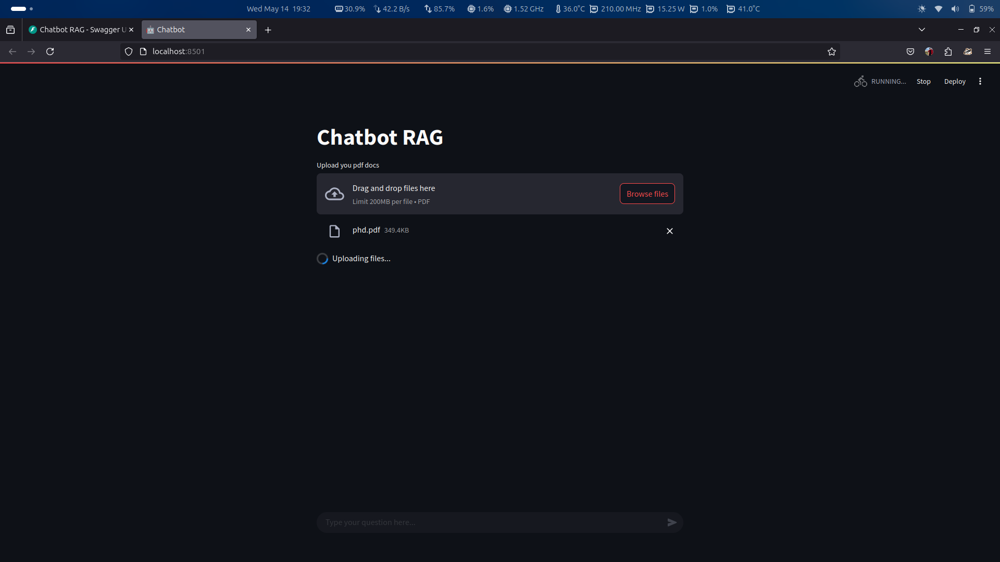
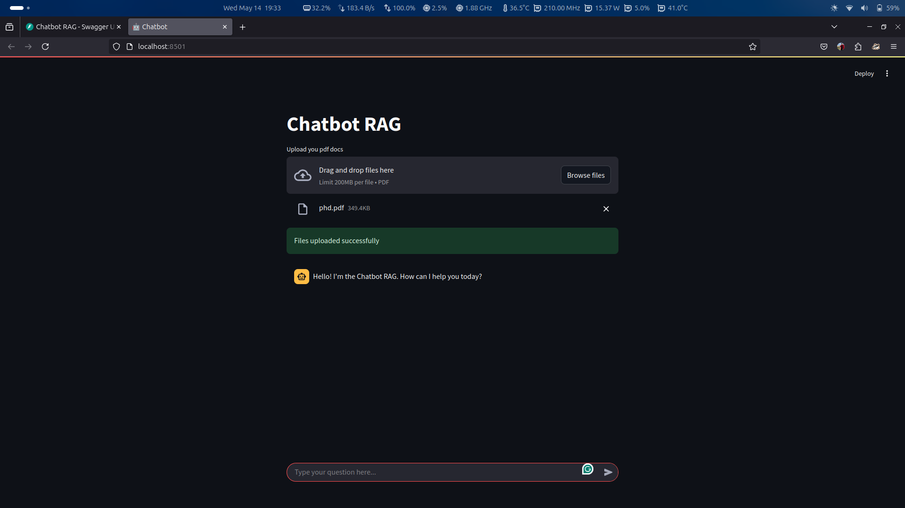

# Building a Full-Stack Retrieval-Augmented Generation (RAG) Chatbot with FastAPI, OpenAI, and Streamlit

This tutorial will guide you step-by-step through building a full-stack Retrieval-Augmented Generation (RAG) chatbot using FastAPI, OpenAI's language model, and Streamlit. By the end, you will have a working chatbot that can answer questions based on the content of uploaded PDF documents.

---

## Table of Contents

1. [Introduction](#introduction)
2. [Project Structure](#project-structure)
3. [Setting Up the Environment](#setting-up-the-environment)
4. [Configuring Environment Variables](#configuring-environment-variables)
5. [Building the Chatbot Logic (`chatbot.py`)](#building-the-chatbot-logic-chatbotpy)
6. [Implementing the FastAPI Server (`api.py`)](#implementing-the-fastapi-server-apipy)
7. [Creating the Streamlit Application (`app.py`)](#creating-the-streamlit-application-apppy)
8. [Running the Application](#running-the-application)
9. [demo](#demo-using-the-chatbot-rag-with-example-images)
10. [Conclusion](#conclusion)
11. [Further Reading](#further-reading)

---

## Introduction

Retrieval-Augmented Generation (RAG) is a powerful approach that combines information retrieval with generative AI models. In this project, we will build a chatbot that can answer user questions based on the content of uploaded PDF documents. The system uses:

- **FastAPI** for building a RESTful API backend.
- **LangChain** for chaining together retrieval and generation logic.
- **OpenAI** for language model and embeddings.
- **Chroma** as a local vector database for storing and searching document embeddings.
- **Streamlit** for a simple, interactive web UI.

---

## Project Structure

Your project should have the following structure:

```plaintext
chatbot-rag/
├── data/                # Directory to hold the local vector database
├── api.py               # FastAPI server
├── app.py               # Streamlit web application
├── chatbot.py           # Core chatbot logic
├── requirements.txt     # Python dependencies
├── README.md            # Project documentation
├── TUTORIAL.md          # This tutorial
└── .env                 # Environment variables (e.g., API keys)
```

---

## Setting Up the Environment

### 1. Create a Virtual Environment

A virtual environment isolates your project dependencies. You can use `venv`, `conda`, or `uv`:

**Using `venv`:**

```sh
python -m venv venv
source venv/bin/activate  # On Windows: venv\Scripts\activate
```

**Using `conda`:**

```sh
conda create -n chatbot-rag python=3.11
conda activate chatbot-rag
```

**Using `uv`:**

```sh
uv init
source .venv/bin/activate  # On Windows: .venv\Scripts\activate
```

### 2. Install Required Dependencies

Navigate to your project directory and install dependencies:

**With pip:**

```sh
pip install -r requirements.txt
```

**With conda:**

```sh
conda install --file requirements.txt
```

**With uv:**

```sh
uv add -r requirements.txt
uv sync
```

---

## Configuring Environment Variables

To keep sensitive information like API keys secure, store them in a `.env` file. This file should **not** be committed to version control.

Create a `.env` file in your project root and add your OpenAI API key:

```env
OPENAI_API_KEY=your_openai_api_key
```

---

## Building the Chatbot Logic (`chatbot.py`)

This file contains the core logic for document storage, retrieval, and question answering.

### 1. Import Required Libraries

We use `dotenv` for loading environment variables, `langchain` for chaining logic, and `logging` for monitoring.

```python
import os
from dotenv import load_dotenv, find_dotenv
from langchain_openai import ChatOpenAI, OpenAIEmbeddings
from langchain_chroma import Chroma
from langchain.prompts import ChatPromptTemplate
from langchain_core.documents.base import Document
from langchain.chains import create_retrieval_chain
from langchain.chains.combine_documents import create_stuff_documents_chain
from langchain_community.document_loaders.blob_loaders import Blob
from langchain_community.document_loaders.parsers import PyPDFParser
import logging
```

### 2. Set Up Logging

Logging helps you monitor your application and debug issues.

```python
logging.basicConfig(level=logging.INFO)
logger = logging.getLogger(__name__)
```

### 3. Load Environment Variables and Initialize OpenAI

We load the API key from `.env` and initialize the embedding and LLM objects.

```python
load_dotenv(find_dotenv())
OPENAI_API_KEY = os.getenv("OPENAI_API_KEY")
if not OPENAI_API_KEY:
    logger.error("OPENAI_API_KEY is not set")
    raise ValueError("OPENAI_API_KEY is not set")

embeddings = OpenAIEmbeddings(model="text-embedding-3-large", api_key=OPENAI_API_KEY)
llm = ChatOpenAI(model="gpt-4o-mini", temperature=0, api_key=OPENAI_API_KEY)
```

### 4. Set Up the Vector Database (Chroma)

A RAG system needs a vector database to store document embeddings for efficient similarity search. Chroma is a simple, local vector database.

```python
chroma = Chroma(
    collection_name="documents",
    collection_metadata={"name": "documents", "description": "store documents"},
    persist_directory="./data",
    embedding_function=embeddings,
)
retriever = chroma.as_retriever(search_kwargs={"k": 2})  # Retrieve top 2 relevant docs
```

### 5. Define the Prompt Template

The prompt guides the LLM to answer based on the retrieved context.

```python
TEMPLATE = """
Here is the context:

<context>
{context}
</context>

And here is the question that must be answered using that context:

<question>
{input}
</question>

Please read through the provided context carefully. Then, analyze the question and attempt to find a
direct answer to the question within the context.

If you are able to find a direct answer, provide it and elaborate on relevant points from the
context using bullet points "-".

If you cannot find a direct answer based on the provided context, outline the most relevant points
that give hints to the answer of the question.

If no answer or relevant points can be found, or the question is not related to the context, simply
state the following sentence without any additional text:

i couldnt find an answer did not find an answer to your question.

Output your response in plain text without using the tags <answer> and </answer> and ensure you are not
quoting context text in your response since it must not be part of the answer.
"""
PROMPT = ChatPromptTemplate.from_template(TEMPLATE)
```

### 6. Create the Retrieval and LLM Chains

These chains connect the retriever and the LLM, so that relevant documents are injected into the prompt before generating an answer.

```python
llm_chain = create_stuff_documents_chain(llm, PROMPT)
retrieval_chain = create_retrieval_chain(retriever, llm_chain)
```

### 7. Define Core Functions

- **Store Document:** Adds parsed documents to the vector database.
- **Parse PDF:** Converts PDF bytes into document objects.
- **Retrieve Document:** Finds relevant documents for a query.
- **Ask Question:** Answers a query using the retrieval chain.

```python
def store_document(documents: list[Document]) -> str:
    chroma.add_documents(documents=documents)
    return "document stored successfully"

parser = PyPDFParser()

def parse_pdf(file_content: bytes) -> list[Document]:
    blob = Blob(data=file_content)
    return [doc for doc in parser.lazy_parse(blob)]

def retrieve_document(query: str) -> list[Document]:
    return retriever.invoke(input=query)

def ask_question(query: str) -> str:
    response = retrieval_chain.invoke({"input": query})
    return response["answer"]
```

---

## Implementing the FastAPI Server (`api.py`)

FastAPI provides a modern, fast web framework for building APIs.

### 1. Import Libraries and Core Functions

```python
from fastapi import FastAPI, UploadFile
from chatbot import retrieve_document, store_document, parse_pdf, ask_question
from pydantic import BaseModel
from typing import List
import logging
```

### 2. Set Up Logging

```python
logging.basicConfig(level=logging.INFO)
logger = logging.getLogger(__name__)
```

### 3. Create FastAPI Instance

```python
app = FastAPI(
    title="Chatbot RAG",
    description="A simple chatbot using OpenAI. Enables asking questions and getting answers based on uploaded documents.",
    version="0.1",
)
```

### 4. Define Pydantic Models

Pydantic models ensure that API requests and responses have the correct structure and types.

```python
class DocumentResponse(BaseModel):
    documents: List
    total: int
    query: str
    error: str = None

class DocumentUploadResponse(BaseModel):
    documents: List
    total: int
    status: str
    error: str = None

class AskResponse(BaseModel):
    query: str
    answer: str
    error: str = None
```

### 5. Implement API Endpoints

- **Root Endpoint:** Health check for the API.
- **Search Documents:** Retrieve relevant documents for a query.
- **Upload Documents:** Upload and store PDF files.
- **Ask Question:** Get an answer to a question based on uploaded documents.

```python
@app.get("/")
def read_root():
    return {
        "service": "RAG Chatbot using OPENAI",
        "description": "Welcome to Chatbot RAG API",
        "status": "running",
    }

@app.get("/documents/{query}")
def search_documents(query: str) -> DocumentResponse:
    try:
        documents = retrieve_document(query)
        return {"documents": documents, "total": len(documents), "query": query}
    except Exception as e:
        logger.error(f"Error searching documents: {e}", exc_info=True)
        return {"error": str(e), "documents": [], "total": 0, "query": query}

@app.post("/documents")
async def upload_documents(files: List[UploadFile]) -> DocumentUploadResponse:
    try:
        documents = []
        for file in files:
            if file.content_type != "application/pdf":
                logger.error(f"Unsupported file type: {file.content_type}")
                raise ValueError("Only PDF files are supported")
            content = await file.read()
            parsed_docs = parse_pdf(content)
            documents.extend(parsed_docs)
        status = store_document(documents)
        return {"documents": documents, "total": len(documents), "status": status}
    except Exception as e:
        logger.error(f"Error uploading documents: {e}", exc_info=True)
        return {"error": str(e), "status": "failed", "documents": [], "total": 0}

@app.get("/ask")
def ask(query: str) -> AskResponse:
    try:
        answer = ask_question(query)
        return {"query": query, "answer": answer}
    except Exception as e:
        logger.error(f"Error asking question: {e}", exc_info=True)
        return {"error": str(e), "query": query, "answer": ""}
```

---

## Creating the Streamlit Application (`app.py`)

Streamlit provides a simple way to build interactive web apps for your Python projects.

### 1. Import Libraries

```python
import streamlit as st
import requests
```

### 2. Define Helper Function

This function sends a question to the FastAPI backend and returns the answer.

```python
def ask(query: str) -> str:
    with st.spinner("Asking the chatbot..."):
        response = requests.get(f"{API_URL}/ask?query={query}")
    if response.status_code == 200:
        data = response.json()
        return data["answer"]
    else:
        return "I couldn't find an answer to your question."
```

### 3. Set Up the Streamlit Page

```python
API_URL = "http://localhost:8000"  # Change if deploying elsewhere
st.set_page_config(page_title="Chatbot", page_icon="🤖")
st.title("Chatbot RAG")
```

### 4. File Upload and Document Storage

Allow users to upload multiple PDF files, which are sent to the backend for parsing and storage.

```python
uploaded_files = st.file_uploader(
    "Upload your PDF documents", type="pdf", accept_multiple_files=True
)
if uploaded_files:
    files = [
        ("files", (file.name, file.getvalue(), "application/pdf"))
        for file in uploaded_files
    ]
    try:
        with st.spinner("Uploading files..."):
            response = requests.post(f"{API_URL}/documents/", files=files)
        if response.status_code == 200:
            st.success("Files uploaded successfully")
            uploaded_files = None
        else:
            st.error("Failed to upload files")
    except Exception as e:
        st.error(f"Error uploading files: {e}")
```

### 5. Chat Interface

Provide a chat-like interface for users to interact with the chatbot.

```python
with st.chat_message(name="ai", avatar="ai"):
    st.write("Hello! I'm the Chatbot RAG. How can I help you today?")

query = st.chat_input(placeholder="Type your question here...")

if query:
    with st.chat_message("user"):
        st.write(query)
    answer = ask(query)
    with st.chat_message("ai"):
        st.write(answer)
```

---

## Running the Application

### 1. Start the FastAPI Server

```sh
fastapi dev api.py #if you want to run for prodcution run fastapi run api.py
```

### 2. Run the Streamlit Application

```sh
streamlit run app.py
```

- The API will be available at `http://127.0.0.1:8000`
- The Streamlit app will run at `http://localhost:8501` by default

---

## Demo: Using the Chatbot RAG (with Example Images)

To help you understand how to use the RAG chatbot, this section provides a step-by-step walkthrough with example screenshots from the [`chatbot-rag/images`](chatbot-rag/images/) folder.

### 1. Uploading PDF Documents

Start by uploading one or more PDF files that the chatbot will use to answer your questions. On the Streamlit web interface, click the "Upload your PDF docs" button and select your files.



Once uploaded, you should see a confirmation message indicating that your files were uploaded successfully.



### 2. Asking a Question

After uploading your documents, you can interact with the chatbot using the chat input at the bottom of the page. Type your question related to the content of your uploaded PDFs and press Enter.


The chatbot will process your question, retrieve relevant information from your documents, and display an answer in the chat window.


## Conclusion

Congratulations! You have built a full-stack Retrieval-Augmented Generation (RAG) chatbot using FastAPI, OpenAI, and Streamlit. You can now upload PDF documents and interact with the chatbot to get answers based on the content of those documents.

This project demonstrates how to combine modern Python tools to create a practical, educational AI application. You can extend this project by adding authentication, deploying to the cloud, or supporting more document types.

---

## Further Reading

- [FastAPI Documentation](https://fastapi.tiangolo.com/)
- [OpenAI API Documentation](https://platform.openai.com/docs/)
- [Streamlit Documentation](https://docs.streamlit.io/)
- [LangChain Documentation](https://python.langchain.com/)
- [Chroma Documentation](https://docs.trychroma.com/)

---

## Author

- **LinkedIn**: [Eng. Oussama MAHDJOUR](https://www.linkedin.com/in/oussamamahdjour/)
- **Email**: [dev.mahdjour.oussama@gmail.com](mailto:dev.mahdjour.oussama@gmail.com)
- **GitHub**: [Oussama Mahdjour](https://github.com/mahdjourOussama)
